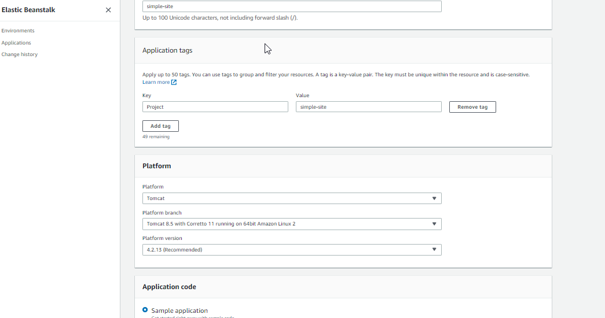
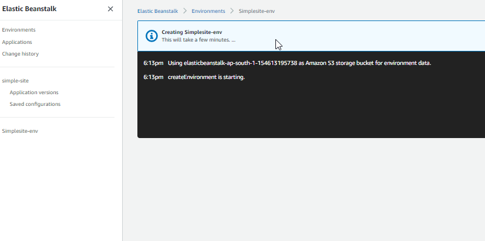
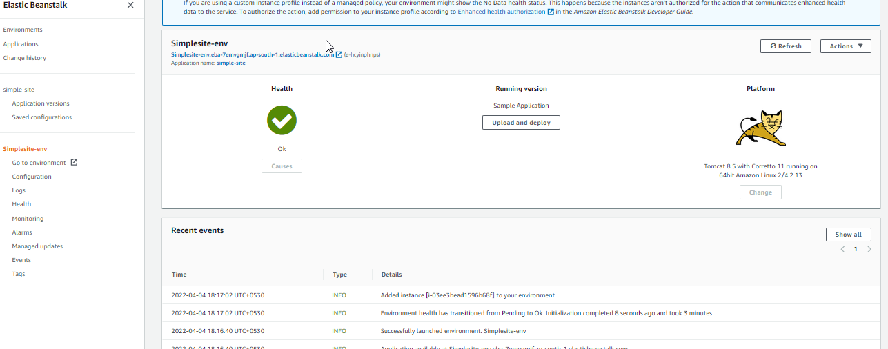
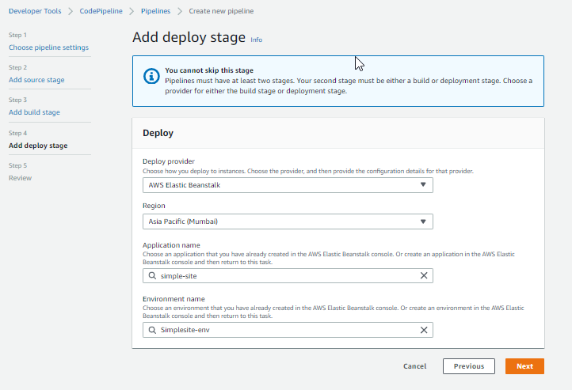
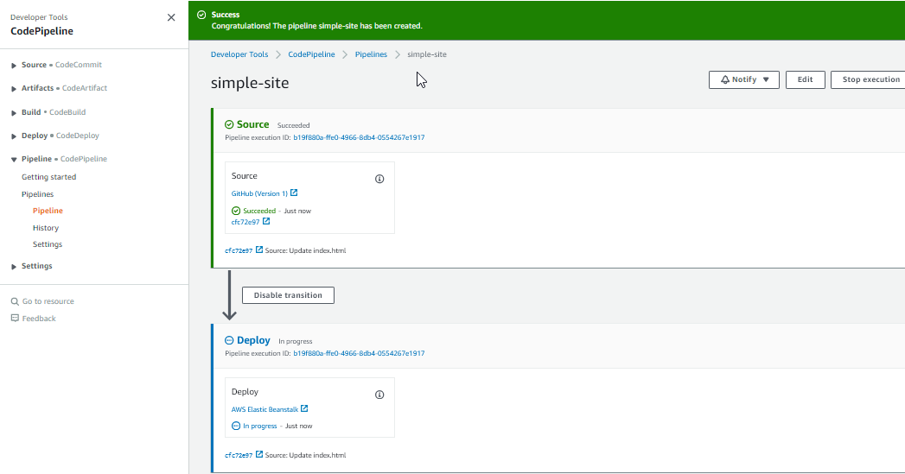
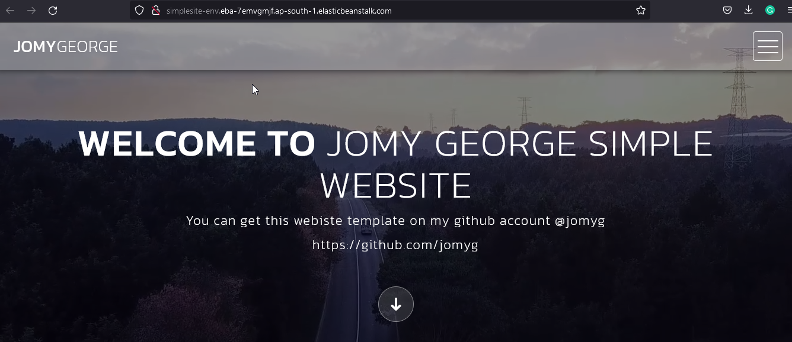
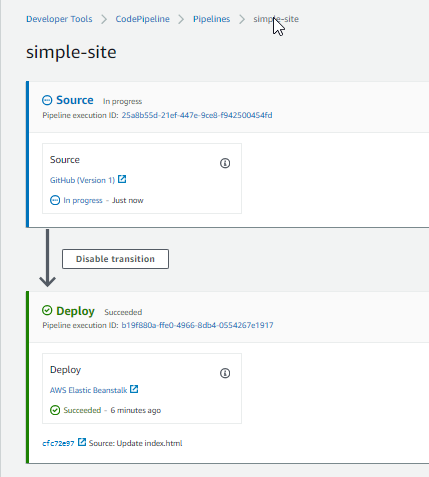
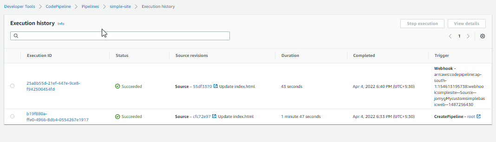
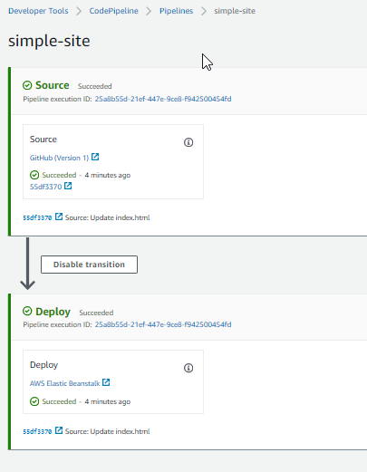
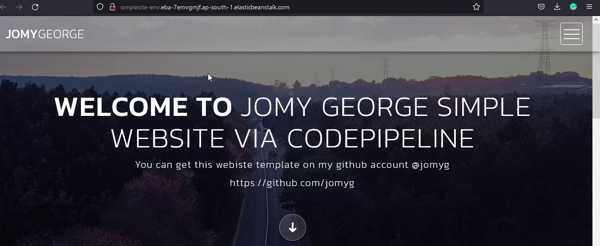

# AWS-Elastic-Beanstalk-Code-Pipeline-git

[](https://travis-ci.org/joemccann/dillinger)

## Description

AWS Elastic Beanstalk is an orchestration service offered by Amazon Web Services for deploying applications which orchestrates various AWS services, including EC2, S3, Simple Notification Service, CloudWatch, autoscaling, and Elastic Load Balancers.Pipeline as code is a practice of defining deployment pipelines through source code, such as Git. Pipeline as code is part of a larger “as code” movement that includes infrastructure as code. Teams can configure builds, tests, and deployment in code that is trackable and stored in a centralized source repository.

AWS CodePipeline is a fully managed continuous delivery service that helps you automate your release pipelines for fast and reliable application and infrastructure updates.

## Pre-Requests
```
Basic knowledge on AWS,  Elastic Beanstalk and Code pipeline
Git repo for the setup
```
> I have uploaded my website contents on https://github.com/jomyg/My-custom-simple-basic-website

> First of all create a Elastic Beanstalk application environment, Here i have used the tomcat as i have to host my website via git. I have already confgured my git account with my aws account.
> After the deploy of Beanstalk application environment completed, we can move on to the Code pipeline for the source code deployment to Beanstalk, I have used the git version 1 which have only the webhooks setup. When we commit any changes on our website contents its will trigger and Beanstalk will deploy the new contents to EC2 via Code PIpeline. I have attached all the snapshots of steps below. Pleas follow and let me know if you have any queries. 


<center> </img></center>
<center> </img></center>
<center> </img></center>
<center> </img></center>
<center> </img></center>
<center> </img></center>
<center> </img></center>
<center> </img></center>
<center> </img></center>
<center> </img></center>
<center> </img></center>


## Conclusion

Deployed my website via AWS Elastic Beanstalk and Code pipeline using git

<center> </img></center>

#### ⚙️ Connect with Me

<p align="center">
<a href="mailto:jomyambattil@gmail.com"></a>
<a href="https://www.linkedin.com/in/jomygeorge11"></a> 
<a href="https://www.instagram.com/therealjomy"></a><br />
